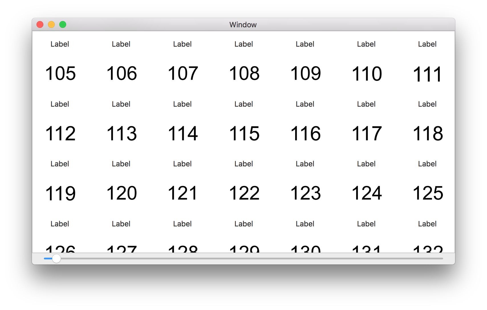

# NSCollectionView Sample Program

## Features

- Reduce memory usage
- Optimize scroll performance
- List 2,000 images
- Resize thumbnail

## Preparation

1. Generate sample images
```
brew install imagemagick
mkdir -p ~/testimage
for i in {0..2000}; do convert -size 1000x1000 label:"$i" ~/testimage/$i.png; done
```

## Screenshot


